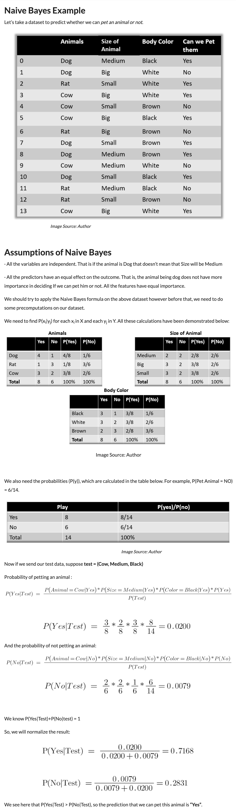

```{r setup, include=FALSE}
knitr::opts_chunk$set(echo = TRUE)
```

---  

Before introducing the Bayes theorem and its application in the Naive Bayes algorithm, it may be
useful to present the broader context: clustering and classification, considered here as two fields of Machine Learning.

## Clustering vs. Classification   

### Clustering (Unsupervised Learning)  

It is the task of segregating groups of data with similar traits and assign them into clusters.  
An easy to understand example is, suppose you are the head of a rental store and wish to understand preferences of your customers to scale up your business. What you can do is to cluster all of your customers into, say, 10 groups based on their purchasing habits and use a separate strategy for customers in each of these 10 groups.  
Broadly speaking, clustering can be divided into two subgroups:  

- *Hard Clustering*: each data point either belongs to a cluster completely or not  
- *Soft Clustering*: instead of putting each data point into a separate cluster, a probability or likelihood of that data point to be in those clusters is assigned.  

### Classification (Supervised Learning)  

It is a task that requires the use of machine learning algorithms that learn how to assign a class label to examples from the problem domain. An easy to understand example is classifying emails as `spam` or `not spam`.  
There are different types of classification:  

- *Binary classification* refers to those classification tasks that have two class labels    
- *Multi-class classification* refers to those classification tasks that have more than two class labels    
- *Multi-label classification* refers to those classification tasks that have two or more class labels, where one or more class labels may be predicted for each example    
- *Imbalanced classification* refers to classification tasks where the number of examples in each class is unequally distributed    

One of the algorithms used for Classification is the **Naive Bayes Algorithm**.  


---  

## Naive Bayes Classifiers  

### What is Naive Bayes?  

The core of the classifier depends on the **Bayes theorem** with an *assumption of independence among predictors*. That means changing the value of a feature doesn’t change the value of another feature.  
It is called **Naive** because of the assumption that 2 variables are independent when they may not be. In a real-world scenario, there is hardly any situation where the features are independent.  

  
Unlike binary classification, multi-class classification does not have the notion of normal and abnormal outcomes. Instead, examples are classified as belonging to one among a range of known classes.  

**Bayes theorem** provides a means for calculating the probability of an event given some information.  
Mathematically, Bayes theorem can be stated as:  

P(B|A) = [P(A|B)*P(B)] / P(A)  

Basically, we are trying to find the probability of event A, given event B is true --> **Conditional Probability**  

**P(B)** is called **prior probability** = the probability of an event before the evidence  

**P(B|A)** is called the **posterior probability** = the probability of an event after the evidence is seen  

It can be used in:  

- *Binary Classification*: refers to those classification tasks that have two class labels. Typically, binary classification tasks involve one class that is the normal state and another class that is the abnormal state. Examples include:  
  - Email spam detection (spam or not)  
  - Churn prediction (churn or not)  
  - Conversion prediction (buy or not)  

- *Multi-Class Classification*: refers to those classification tasks that have more than two class labels.
Examples include:  
  - Face classification  
  - Plant species classification  
  - Optical character recognition  
  
  
### Pro and Cons  

This probabilistic machine learning model is **fast and easy to build** and is mostly used for **large datasets**. Along with simplicity, Naive Bayes is known to **outperform even highly sophisticated classification methods**. Naive Bayes is also a good choice when **CPU and memory** resources are a limiting factor.  
Its main disadvantage is that it **can’t learn interactions** between features.


### Use Cases  

Naive Bayes algorithms are used in:  
  - Face recognition  
  - Weather prediction   
  - Medical Diagnosis  
  - Recommendation systems like Netflix, Amazon  
  - To mark an email as spam or not spam  
  - News classification  
  - Sentiment Analysis  
  - etc
  
### Application Example  

Here is an application example to help understand the use of the Naive Bayes Algorithm.  
Source: <https://www.analyticsvidhya.com/blog/2021/09/naive-bayes-algorithm-a-complete-guide-for-data-science-enthusiasts/>





---